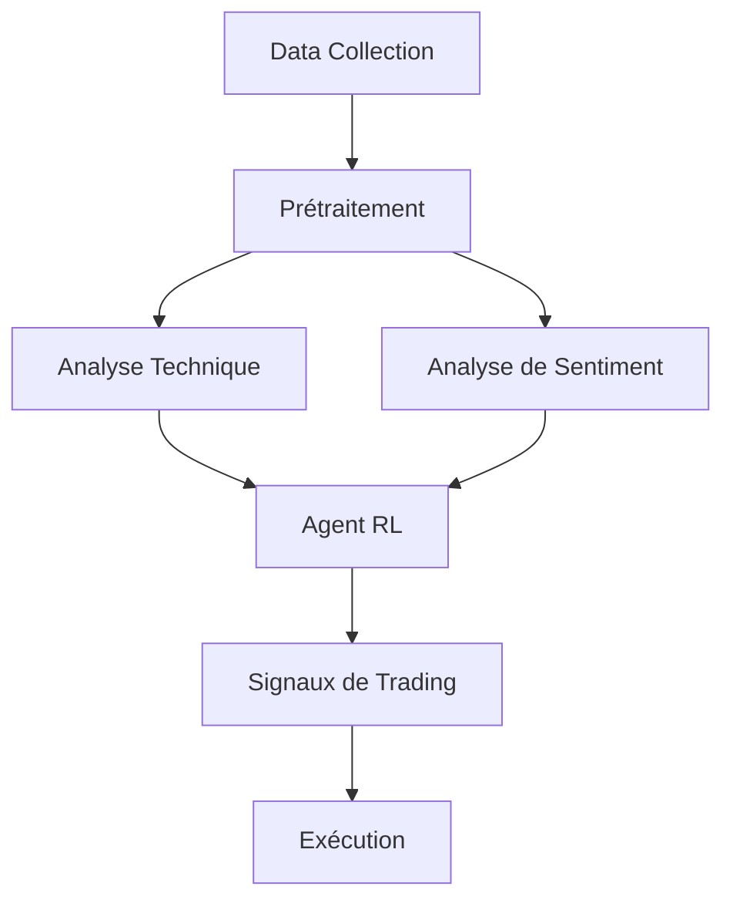
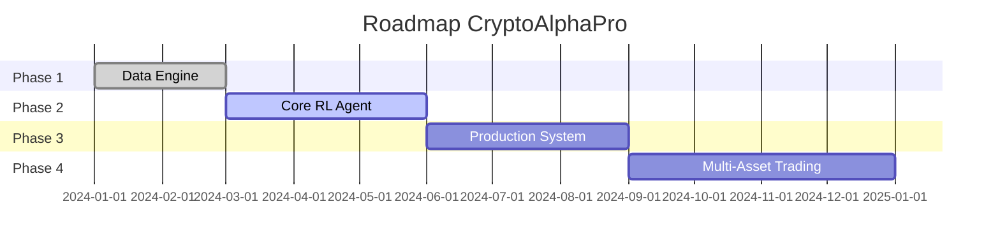

### **📌 Titre**  
**CryptoAlphaPro** - Système de Trading Algorithmique pour Cryptomonnaies combinant RL et LLMs

---

### **🎯 Utilité**  
*Automatiser les décisions de trading crypto en combinant :*  
1. **Analyse technique** (150+ indicateurs)  
2. **Sentiment marché** (actualités + réseaux sociaux)  
3. **Apprentissage par Renforcement** (DQN/PPO)  
4. **Gestion des risques avancée** (ATR, stop-loss dynamiques)  

*Objectifs clés :*  
✅ Maximiser les rendements ajustés au risque  
✅ S'adapter en temps réel aux conditions de marché  
✅ Exploiter les inefficacités marché via l'IA  

---

### **⚙️ Architecture Globale**  


---

### **🔧 Fonctionnement Technique**  
1. **Collecte de Données**  
   - *Sources* : CoinGecko, CryptoPanic, Twitter/Reddit  
   - *Fréquence* : 5min à 1h (streaming + batch)  
   - *Données* : Prix, Volume, On-chain, Sentiment textuel  

2. **Moteur d'Analyse**  
   - **Indicateurs Techniques** (MACD, Ichimoku, ATR...)  
   - **NLP Avancé** (Entités nommées, Analyse de polarité)  
   - **Features Engineering** : 500+ caractéristiques combinées  

3. **Cœur IA**  
   - **Agent DQN** :  
     - États : Vecteur de 150 dimensions  
     - Actions : {Acheter, Vendre, Hold} + % de position  
     - Récompense : Sharpe Ratio modifié + pénalités de risque  
   - **Meta-Learning** : Transfert entre actifs (BTC → ETH → SOL)  

4. **Système de Production**  
   - API REST FastAPI  
   - Dashboard Streamlit  
   - Connecteurs Binance/FTX/Kraken  
   - Mode Paper Trading intégré  

---

### **🚀 Features Innovantes**  
- **Dynamic Stop-Loss** : Basé sur la volatilité (ATR rolling)  
- **Sentiment Weighting** : Pondération des signaux par crédibilité source  
- **Multi-Temporal Modeling** : Analyse simultanée 1h/4h/1j  
- **Risk-on/Risk-off** : Détection automatique des régimes de marché  

---

### **📈 Résultats Attendus**  
| Métrique               | Cible       |
|------------------------|-------------|
| Sharpe Ratio           | > 2.5       |
| Max Drawdown           | < 15%       |
| Win Rate               | > 55%       |
| Profit Factor          | > 1.8       |
| Latence Exécution      | < 500ms     |

---

### **🛠 Stack Technique**  
```python
{
  "Langage": "Python 3.10+",
  "ML/RL": "PyTorch, Stable-Baselines3, RLlib",
  "NLP": "spaCy, Transformers, NLTK",
  "Data": "Pandas, Dask, TA-Lib",
  "Visualisation": "Plotly, Streamlit",
  "Infra": "Docker, Kubernetes, FastAPI",
  "Monitoring": "Prometheus, Grafana"
}
```

---

### **🌐 Cas d'Usage**  
1. **Fonds Hedge Crypto** : Allocation automatique de portefeuille  
2. **Particuliers** : Bot trading via interface simplifiée  
3. **Recherche** : Backtesting de stratégies alternatives  
4. **Market Makers** : Optimisation de spread  

---

### **🔮 Roadmap**  


---

### 🔧 Consignes pour le projet AI Trading – Compatibilité OS & Environnement

* Le projet **doit fonctionner de manière identique sous Windows et Linux** (Docker inclus).
* L’exécution doit se faire **en priorité sur GPU via CUDA si disponible**, sinon basculer automatiquement sur **CPU**.
* Le script `setup_env.bat` (ou son équivalent `.sh` selon l’OS) doit :

  * Configurer l’environnement CUDA,
  * Être utilisé pour initialiser l’environnement d’exécution, **quel que soit l’OS** (Windows, Linux, Docker).
* Si des bibliothèques ou dépendances sont **disponibles uniquement sur un OS** :

  * Elles doivent être **utilisées sur cet OS**,
  * Mais le projet doit **rester fonctionnel sur l’autre OS** via des alternatives ou du fallback.
* En résumé : **exploiter toutes les ressources et dépendances disponibles selon l’OS, tout en assurant une compatibilité et cohérence globale du projet.**

---
