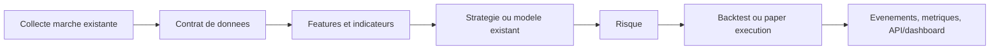

# Architecture actuelle

## Noyaux existants a preserver

| Domaine | Emplacements actuels | Role observe | Decision initiale |
| --- | --- | --- | --- |
| Configuration | `ai_trading/config.py`, `ai_trading/config/trading_pairs.py`, `web_app/config.py` | exchanges, paires, runtime web | cartographier puis unifier les valeurs partagees sans casser les imports |
| Donnees | `ai_trading/data/`, `ai_trading/data_processor.py`, `ai_trading/utils/*collector*` | marche, carnet, stockage, pretraitement | conserver les collecteurs actifs; definir leurs contrats communs |
| Indicateurs/features | `data/technical_indicators.py`, `indicators/`, `rl/technical_indicators.py`, `utils/technical_analyzer.py` | calcul de signaux et features | choisir une implementation par famille apres comparaison de sorties |
| LLM/prediction | `ai_trading/llm/`, `ai_trading/models/` | sentiment, prediction, calibration, reporting | isoler les contrats d'entree/sortie avant regroupement |
| RL | `ai_trading/rl/`, `rl_agent.py` | environnements, agents, buffers, training | garder les agents valides; reduire les runners et wrappers concurrents |
| Risque/execution | `risk/`, `execution/`, `orders/`, `ml/backtesting/` | limites, ordres, fills, simulation | fixer un schema d'ordre commun avant toute fusion |
| Interfaces | `ai_trading/api.py`, `ai_trading/api/`, `dashboard/`, `web_app/` | FastAPI, routeur API, Dash, Flask | inventorier les utilisateurs avant choisir une surface principale |
| Tests/exemples | `ai_trading/tests/`, sous-dossiers de modules, `examples/`, `web_app/tests/` | tests unitaires, demos, sorties | separer progressivement test, demo et runtime sans supprimer de couverture |

## Flux a rendre explicite

Le travail P0-P4 consiste a rendre ce flux unique et observable. Les composants existants restent en place tant que leurs appelants ne sont pas migres.

## Points de vigilance

- `ai_trading/api.py` et `ai_trading/api/` portent le meme nom : verifier la resolution Python et les commandes Docker avant toute modification.
- Plusieurs fichiers ont le meme role apparent. Un meme nom n'est pas une preuve de doublon fonctionnel : comparer contrat, appelants et tests avant regrouper.
- Les exemples et tests peuvent etre les seuls consommateurs d'un module. Ils doivent etre migres ou classes avant toute decision.
