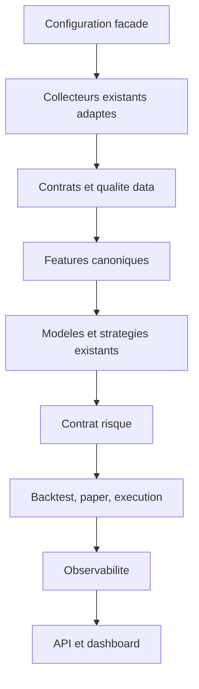

# Architecture cible par consolidation

## Cible fonctionnelle

## Regles d'architecture

- Les modules de domaine gardent leur implementation; ils communiquent par contrats explicites, pas par imports transverses caches.
- Un facade publique est preferable a un deplacement massif de fichiers.
- Les implementations historiques deviennent des adaptateurs tant que des consommateurs existent.
- Chaque interface affiche les memes metriques et ne recalcule pas sa propre logique metier.
- Les options GPU, distribuees et experimentales restent optionnelles et hors du chemin par defaut.

## Non-objectifs P0-P4

- reecrire les agents RL ou les modeles LLM;
- remplacer tous les frameworks;
- supprimer les exemples ou les tests existants par commodite;
- activer le trading live.
