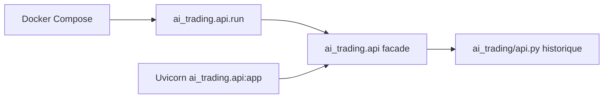

# Rapport execution P2

## Statut

PASS - 2026-07-21.

## Consolidation effectuee

Le conflit `ai_trading/api.py` et `ai_trading/api/` est traite sans deplacement ni duplication du module historique.

- `ai_trading/api/application.py` charge le fichier historique a la demande.
- Le package expose `run`, `get_app` et `app` paresseux pour les import strings Uvicorn.
- Compose utilise `python -m ai_trading.api.run`; le contournement `runpy.run_path` est retire.
- L'API ne charge plus la pile data/RL au health check. Les imports lourds restent dans les factories/endpoints qui les utilisent.
- Le `FileHandler` API est configure au demarrage, pas a l'import; les health checks n'ecrivent plus de fichier de log par effet de bord.

## Preuves

| Check | Resultat |
| --- | --- |
| `tests/p2` | 5 tests passes |
| delegation facade sur module temporaire | PASS |
| import leger du package et runner | PASS |
| FastAPI `get_app()` et `/health` via ASGI | PASS |
| Compose et AST P2 | PASS |

## Limites

- `/predict`, `/train` et `/backtest` sont preserves mais non executes : ils exigent les dependances data/RL et des donnees/modeles locaux.
- Aucun service Docker n'a ete demarre et aucune requete exchange n'a ete envoyee.
